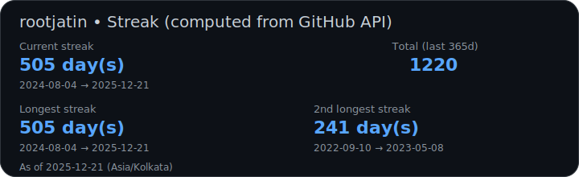
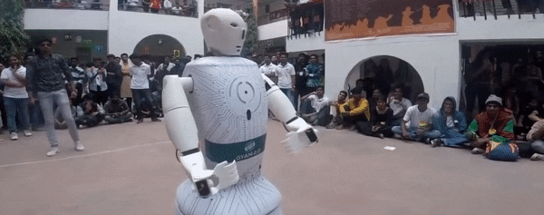
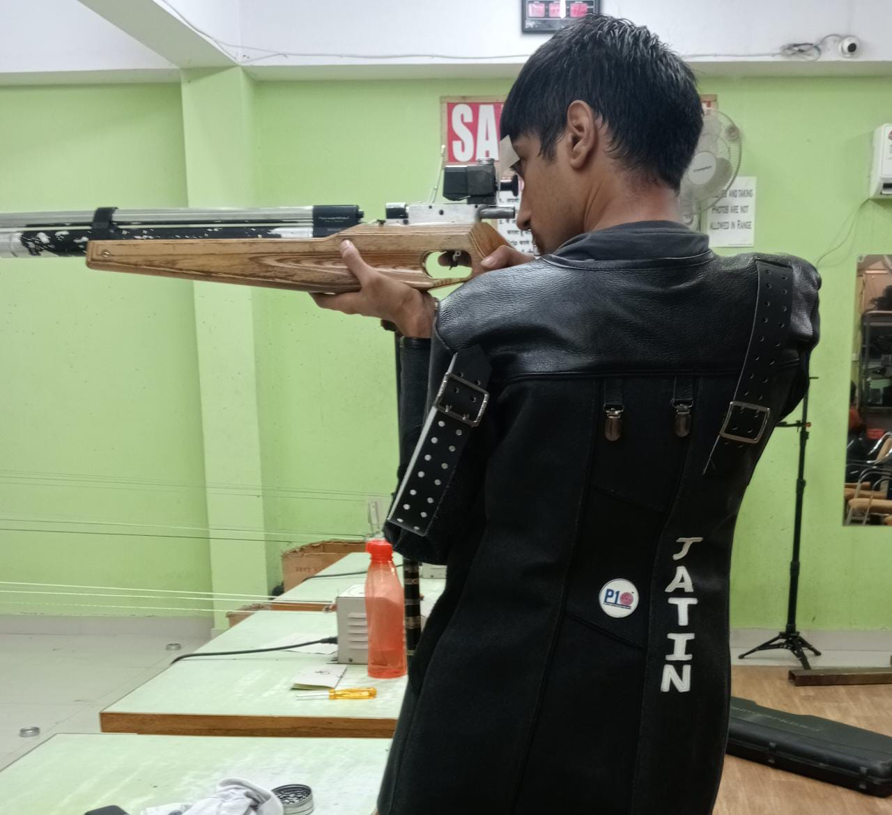

<!-- ================================
     ROOTJATIN • TECH/SPACE THEME
     ================================ -->

  

<h1 align="center">Jatin Sharma</h1>

  

  
  
  
  

  

---

<!-- ================================
     🚀 BIG FUSS: PLAY MY LIFE GAME
     ================================ -->

<h2>🚀 START HERE: Play My “Life Game”</h2>

My interactive world — projects, experiments, builds, and random tech quests.  
If you’ve got <b>2 minutes</b>, press start and explore. 🕹️✨

  

<table>
  <tr>
    <td align="center" width="33%">
      <b>🕹️ Quick Play</b> 
      Jump in, click around
    </td>
    <td align="center" width="33%">
      <b>🧠 Hidden Lore</b> 
      Find the tech secrets
    </td>
    <td align="center" width="33%">
      <b>🏆 Challenge Mode</b> 
      Try to break it (politely)
    </td>
  </tr>
</table>

If you liked it: ⭐ star a repo you enjoy, or send feedback — I actually read it.

---

## ⚡ Status Panel (Streak Highlight)

  

  
  

---

## 👨‍💻 About Me (Fast Scan)

- 🛰️ **Control Systems Developer @ NCRA (India)**
- 🤖 Robotics + automation (hardware + software, sensing → control → actuation)
- 🌌 **Space enthusiast** — telescopes, astrophysics, space-tech
- 🎯 **Competitive shooter** — **10m Air Rifle** & **50m 3-Position (3P)**
- 🧠 Interests: **OpenGL**, embedded, tooling, testing, CI/CD, reliability

---

## 🎮 My Game / Experiments Playground

  

---

## 🤖 Flagship Project — Humanoid Robot “Gyani 2.0”

  

  <b>Tech vibe:</b> controls • embedded firmware • sensors • actuation • telemetry • systems integration

---

## 🌌 Space Mode / 🎯 Range Mode

<table>
  <tr>
    <td width="50%" align="center">
      
        
      <b>Space Enthusiast 🌌</b>
       
      Always exploring astronomy + space-tech.
    </td>
    <td width="50%" align="center">
      
        
      <b>Space Aesthetic</b>
       
      My First Telscopic Image 
    </td>
  </tr>
</table>

  
   
  <b>Competitive Shooter 🎯</b>
   
  10m Air Rifle • 50m 3-Position (3P)

---

## 🧰 Toolbox (Core Tech)

  

  
  
  
  

---

## 🐍 Contribution Snake

  <picture>
    <source media="(prefers-color-scheme: dark)" srcset="dist/github-snake-dark.svg" />
    <source media="(prefers-color-scheme: light)" srcset="dist/github-snake.svg" />
    
  </picture>

---

## 📫 Contact

  <a href="mailto:rootjatin@gmail.com"><b>rootjatin@gmail.com</b></a>
   
  <a href="https://rootjatin.github.io"><b>rootjatin.github.io</b></a>

